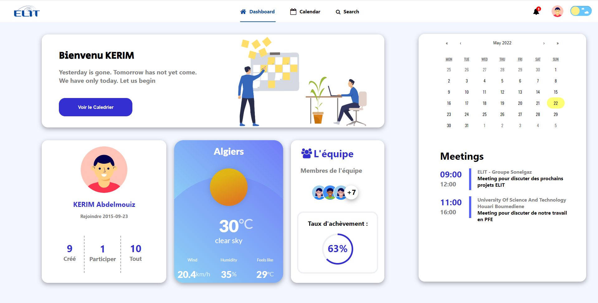
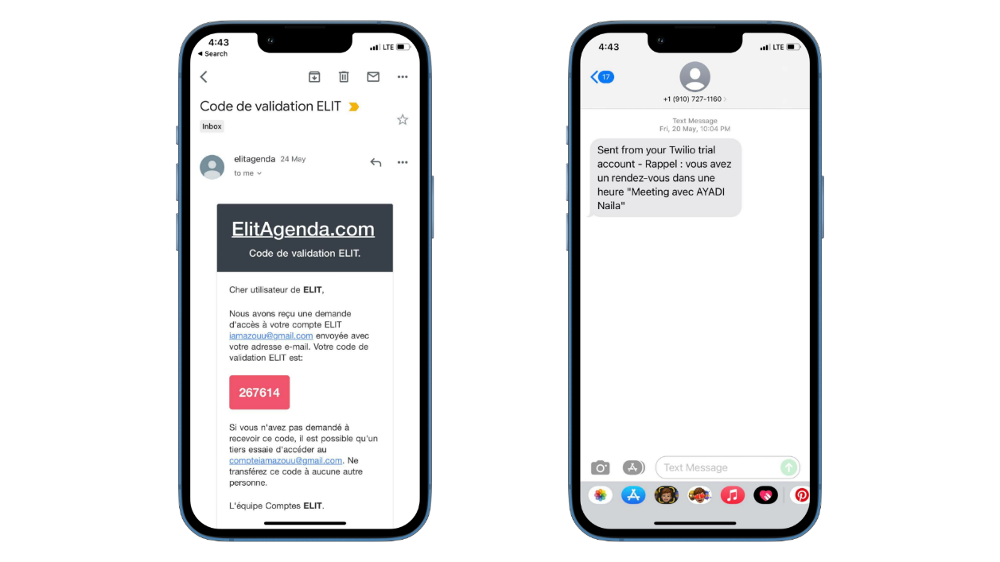
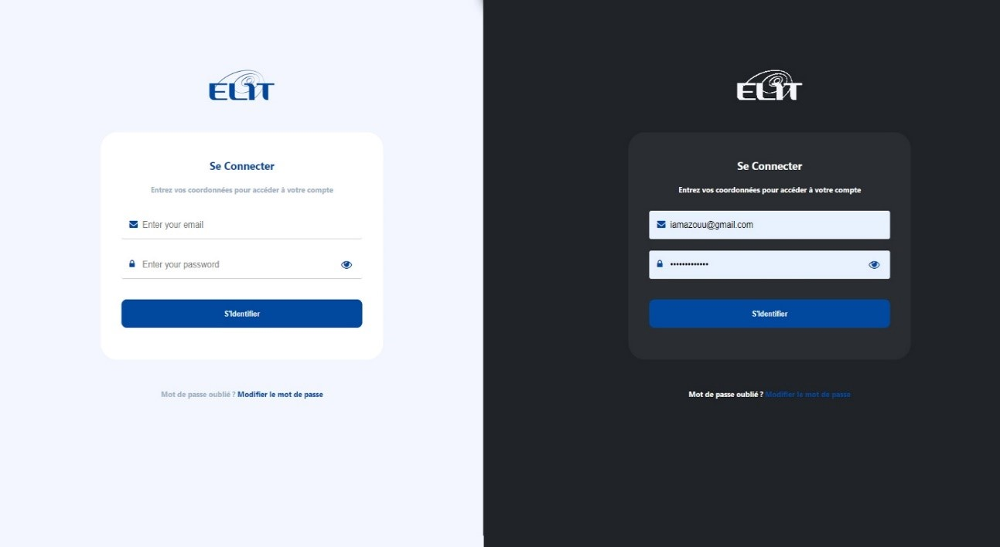
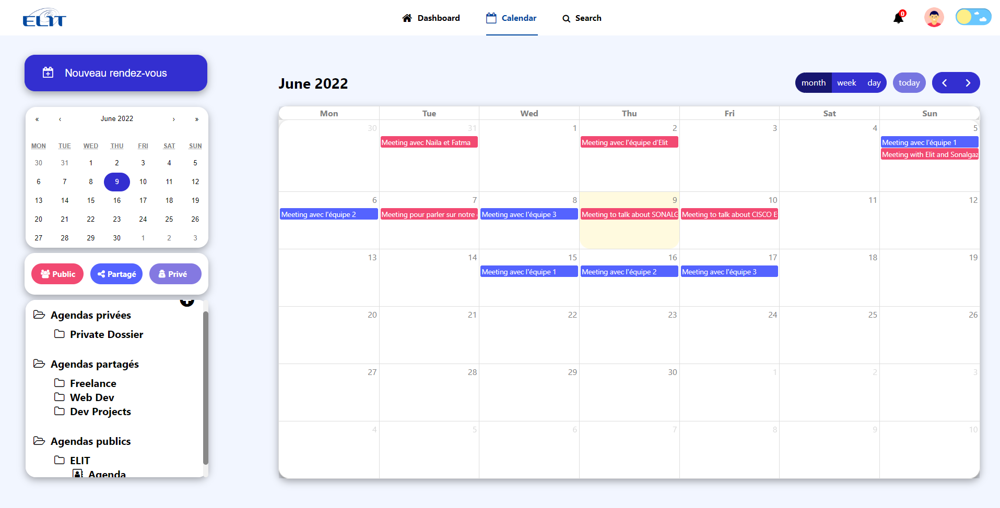
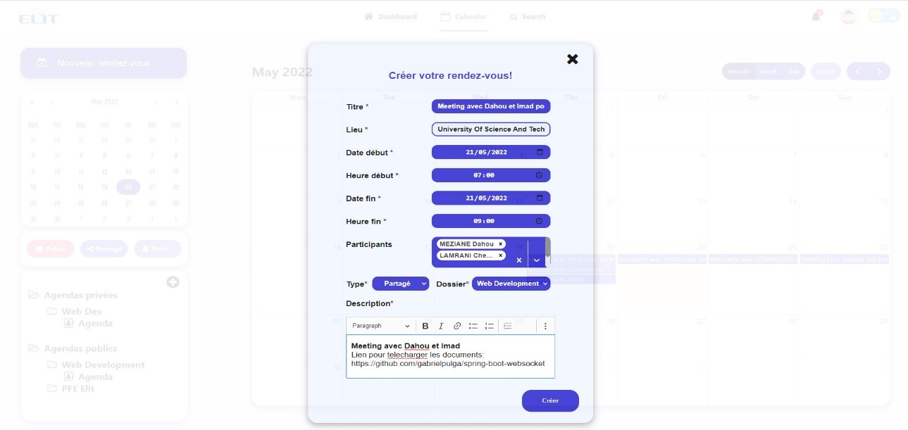
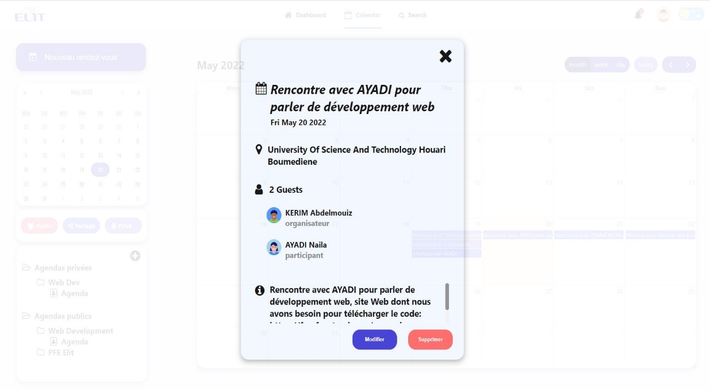
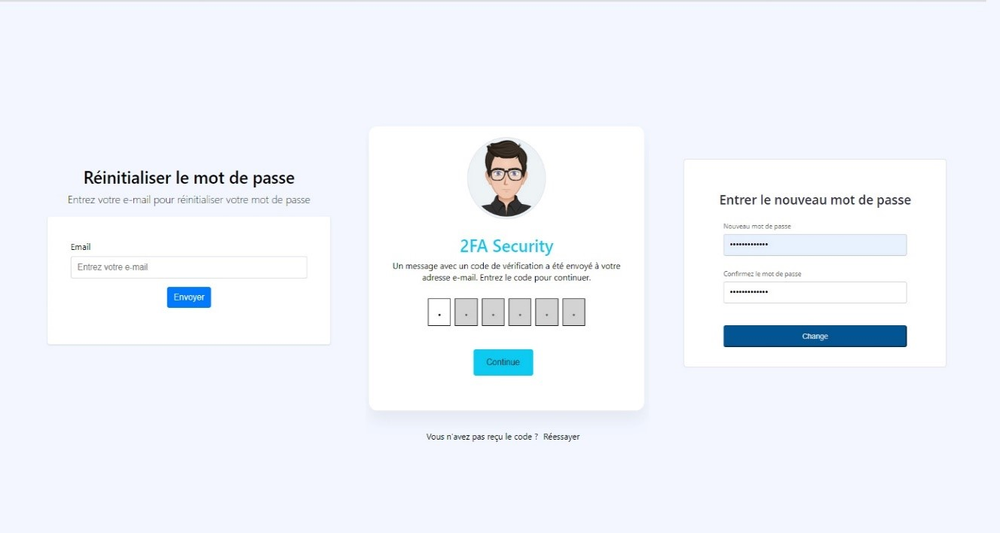

<h1 align="center">
  ELIT Shared Calendar
   
</h1>

<h3 align="center">
ELIT Shared Calendar allows employees of ELIT frequently in
moving to stay connected to their business. It provides a centralized means of
set up meetings and projects. A group calendar can be
accessed 24/7 from any internet-connected device. The Chiefs
projects, consultants, vendors and other employees can access the
their team's schedule when they are out of the office visiting
customers or deal with other matters. They can use the group calendar
to track meetings, conference calls and project deadlines.
Not only can employees view their own schedules, but they
can also get an overview of their colleagues' calendars.
</h3>
 

 

# Technical Details
This application is web-based, For all the front-end components, [ReactJs](https://reactjs.org/) is used and the player is completely HTML5-based. The application is essentially split into Grails for a REST-API, and ReactJs for the frontend.

ELIT Shared Calendar uses [Spring Boot](https://spring.io/projects/spring-boot) fot the Backend and [MySQL](https://www.mysql.com/) as database management system (DBMS).

# Application Security

## •	Password encryption
Passwords are encrypted in the database using the “BCrypt” function of the “BCryptPasswordEncoder” class, a class predefined in SpringBoot.
The encryption of passwords is necessary for the security of the data of the users of our application in the event that the application is hacked, the hacker will not be able to access their profile and steal their personal information.

## •	JWTauthentification
“Json web token” The JSON Web Token (JWT), is an open standard that defines a compact, self-contained way to securely transmit information between parties as a JSON object.  
A JWT can be sent through a URL, through a POST parameter, or in an HTTP header, and it is transmitted quickly.   
A JWT contains all the required information about an entity to avoid querying a database multiple times. The recipient of a JWT also does not need to call a server to validate the token.  
A well-formed JWT consists of three concatenated Base64url encoded strings, separated by dots (.):  
• JOSE Header: contains metadata about the type of token and the cryptographic algorithms used to secure its content. 
• JWS payload: Contains verifiable security claims, such as user identity and granted permissions. 
• JWS signature: Used to validate that the token is trustworthy and has not been tampered with. JWTs must be checked before using them

# Notification systems

When the user creates/modifies an appointment, the system sends an email to the user which contains the description of the appointment thanks to the "JavaMailSender" function. 
The system notifies the user of his appointment for the day one hour before thanks to the "twilio" service.

# Some App Images

  

  

  

  

  

 
